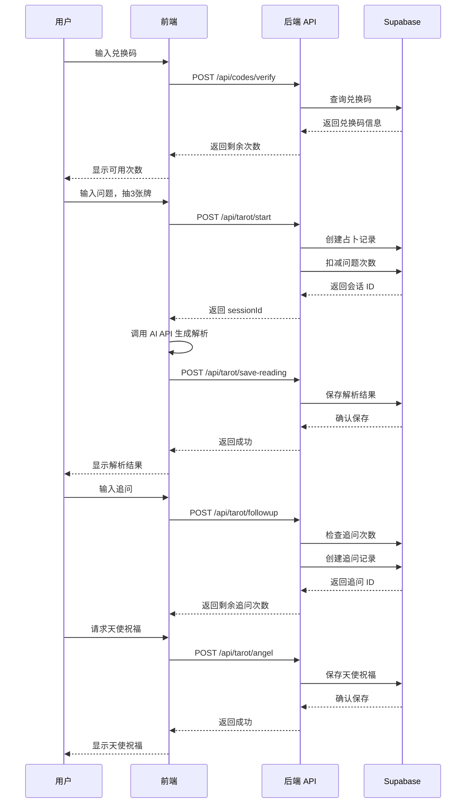

# 橘子塔罗 API 接口文档

## 🌐 基础信息

**Base URL**: `https://你的域名.vercel.app`

**Content-Type**: `application/json`

**认证方式**: 兑换码（code 参数）

---

## 📚 API 端点列表

### 用户端 API（6个）

| 端点 | 方法 | 功能 | 认证 |
|------|------|------|------|
| `/api/codes/verify` | POST | 验证兑换码 | ✓ |
| `/api/tarot/start` | POST | 开始占卜 | ✓ |
| `/api/tarot/save-reading` | POST | 保存解析结果 | ✓ |
| `/api/tarot/followup` | POST | 添加追问 | ✓ |
| `/api/tarot/angel` | POST | 保存天使祝福 | ✓ |
| `/api/tarot/history` | GET | 获取历史记录 | ✓ |

### 管理端 API（待开发）

| 端点 | 方法 | 功能 | 认证 |
|------|------|------|------|
| `/api/admin/auth/login` | POST | 管理员登录 | - |
| `/api/admin/auth/me` | GET | 获取管理员信息 | Token |
| `/api/admin/codes/generate` | POST | 生成兑换码 | Token |
| `/api/admin/codes` | GET | 兑换码列表 | Token |
| `/api/admin/codes/:id` | PATCH | 更新兑换码 | Token |
| `/api/admin/stats` | GET | 统计数据 | Token |
| `/api/admin/sessions` | GET | 占卜记录列表 | Token |

---

## 📖 用户端 API 详细说明

### 1. 验证兑换码

验证兑换码有效性并返回剩余次数。

**端点**: `POST /api/codes/verify`

**请求体**:
```json
{
  "code": "JUZI-TEST-0001"
}
```

**成功响应** (200):
```json
{
  "valid": true,
  "code": "JUZI-TEST-0001",
  "questionLeft": 3,
  "followupPerQuestion": 3,
  "expiresAt": "2026-12-31T23:59:59.000Z",
  "firstUsedAt": null,
  "message": "兑换码有效，还可提问 3 次"
}
```

**错误响应** (400):
```json
{
  "valid": false,
  "error": "无效的兑换码"
}
```

**可能的错误信息**:
- `"请输入兑换码"` - 未提供 code 参数
- `"无效的兑换码"` - 兑换码不存在
- `"兑换码已过期"` - expiresAt < 当前时间
- `"兑换码已被禁用"` - status = 'disabled'
- `"兑换码次数已用完"` - question_used >= question_limit

---

### 2. 开始占卜

创建新占卜记录并扣减问题次数。

**端点**: `POST /api/tarot/start`

**请求体**:
```json
{
  "code": "JUZI-TEST-0001",
  "question": "我的事业发展方向是什么？",
  "cards": [
    {
      "index": 3,
      "name": "女祭司 The High Priestess",
      "reversed": false,
      "position": "过去 / 根源"
    },
    {
      "index": 7,
      "name": "恋人 The Lovers",
      "reversed": true,
      "position": "现在 / 状态"
    },
    {
      "index": 15,
      "name": "节制 Temperance",
      "reversed": false,
      "position": "未来 / 建议"
    }
  ]
}
```

**字段说明**:
- `code` (string, 必需): 兑换码
- `question` (string, 必需): 用户问题，至少5个字符
- `cards` (array, 必需): 3张塔罗牌信息
  - `index` (number): 牌的编号 (0-78)
  - `name` (string): 牌名
  - `reversed` (boolean): 是否逆位
  - `position` (string): 在牌阵中的位置

**成功响应** (200):
```json
{
  "success": true,
  "sessionId": "550e8400-e29b-41d4-a716-446655440000",
  "questionLeft": 2,
  "followupLeft": 3,
  "message": "占卜开始成功"
}
```

**错误响应** (400):
```json
{
  "success": false,
  "error": "兑换码次数已用完"
}
```

**可能的错误信息**:
- `"请提供兑换码"`
- `"问题至少需要5个字符"`
- `"必须提供3张牌"`
- `"兑换码无效"` / `"兑换码已过期"` / `"兑换码次数已用完"`
- `"创建占卜记录失败"`

**副作用**:
- 兑换码的 `question_used` 加 1
- 兑换码的 `last_used_at` 更新为当前时间
- 如果是首次使用，`first_used_at` 设置为当前时间

---

### 3. 保存解析结果

保存 AI 对塔罗牌的解析结果。

**端点**: `POST /api/tarot/save-reading`

**请求体**:
```json
{
  "sessionId": "550e8400-e29b-41d4-a716-446655440000",
  "code": "JUZI-TEST-0001",
  "reading": "女祭司在过去位置暗示..."
}
```

**字段说明**:
- `sessionId` (string, 必需): 占卜会话 ID（从 `/api/tarot/start` 返回）
- `code` (string, 必需): 兑换码
- `reading` (string, 必需): AI 解析文本

**成功响应** (200):
```json
{
  "success": true,
  "message": "解析结果已保存"
}
```

**错误响应** (400/404):
```json
{
  "success": false,
  "error": "占卜会话不存在或无权访问"
}
```

**副作用**:
- tarot_sessions 表的 `ai_reading` 字段更新
- tarot_sessions 表的 `status` 更新为 'completed'

---

### 4. 添加追问

为已有占卜添加追问，验证追问次数限制。

**端点**: `POST /api/tarot/followup`

**请求体**:
```json
{
  "sessionId": "550e8400-e29b-41d4-a716-446655440000",
  "code": "JUZI-TEST-0001",
  "question": "那我应该如何提升自己？",
  "card": {
    "index": 21,
    "name": "星星 The Star",
    "reversed": false
  },
  "reading": "星星正位在追问中..."
}
```

**字段说明**:
- `sessionId` (string, 必需): 占卜会话 ID
- `code` (string, 必需): 兑换码
- `question` (string, 必需): 追问内容，至少2个字符
- `card` (object, 必需): 追问牌信息
- `reading` (string, 可选): AI 追问解析（可以先调用此 API，再调用 AI）

**成功响应** (200):
```json
{
  "success": true,
  "followupId": "660e8400-e29b-41d4-a716-446655440000",
  "followupLeft": 2,
  "message": "追问成功，本题还可追问 2 次"
}
```

**错误响应** (400):
```json
{
  "success": false,
  "error": "每题最多追问 3 次",
  "followupLeft": 0
}
```

**可能的错误信息**:
- `"请提供占卜会话 ID"`
- `"请提供兑换码"`
- `"追问至少需要2个字符"`
- `"请提供追问牌"`
- `"占卜会话不存在或无权访问"`
- `"兑换码无效"`
- `"每题最多追问 3 次"`

**次数限制**:
- 每个占卜会话的追问次数由兑换码的 `followup_limit_per_question` 决定（默认3次）
- 追问不扣减兑换码的问题次数

---

### 5. 保存天使祝福

为占卜添加天使祝福卡（不扣次数）。

**端点**: `POST /api/tarot/angel`

**请求体**:
```json
{
  "sessionId": "550e8400-e29b-41d4-a716-446655440000",
  "code": "JUZI-TEST-0001",
  "card": {
    "index": 0,
    "name": "愚者 The Fool",
    "reversed": false
  },
  "text": "愿你在还没有完全确定答案的时候..."
}
```

**字段说明**:
- `sessionId` (string, 必需): 占卜会话 ID
- `code` (string, 必需): 兑换码
- `card` (object, 必需): 天使祝福卡信息
- `text` (string, 可选): 天使祝福文本

**成功响应** (200):
```json
{
  "success": true,
  "message": "天使祝福已保存"
}
```

**错误响应** (400):
```json
{
  "success": false,
  "error": "已有天使祝福，不能重复添加"
}
```

**可能的错误信息**:
- `"请提供占卜会话 ID"`
- `"请提供兑换码"`
- `"请提供天使祝福卡"`
- `"占卜会话不存在或无权访问"`
- `"已有天使祝福，不能重复添加"`

**限制**:
- 每个占卜会话只能有一次天使祝福
- 天使祝福不扣减任何次数

---

### 6. 获取历史记录

获取指定兑换码的所有占卜记录（7天内）。

**端点**: `GET /api/tarot/history?code=JUZI-TEST-0001`

**查询参数**:
- `code` (string, 必需): 兑换码

**成功响应** (200):
```json
{
  "success": true,
  "total": 2,
  "sessions": [
    {
      "id": "550e8400-e29b-41d4-a716-446655440000",
      "question": "我的事业发展方向是什么？",
      "cards": [
        {
          "index": 3,
          "name": "女祭司 The High Priestess",
          "reversed": false,
          "position": "过去 / 根源"
        },
        {
          "index": 7,
          "name": "恋人 The Lovers",
          "reversed": true,
          "position": "现在 / 状态"
        },
        {
          "index": 15,
          "name": "节制 Temperance",
          "reversed": false,
          "position": "未来 / 建议"
        }
      ],
      "ai_reading": "女祭司在过去位置暗示...",
      "angel_blessing_card": {
        "index": 0,
        "name": "愚者 The Fool",
        "reversed": false
      },
      "angel_blessing_text": "愿你在还没有完全确定答案的时候...",
      "status": "completed",
      "created_at": "2026-06-26T10:30:00.000Z",
      "expires_at": "2026-07-03T10:30:00.000Z",
      "followups": [
        {
          "id": "660e8400-e29b-41d4-a716-446655440000",
          "followup_question": "那我应该如何提升自己？",
          "card": {
            "index": 21,
            "name": "星星 The Star",
            "reversed": false
          },
          "ai_reading": "星星正位在追问中...",
          "created_at": "2026-06-26T10:35:00.000Z"
        }
      ]
    }
  ]
}
```

**错误响应** (400):
```json
{
  "success": false,
  "error": "请提供兑换码"
}
```

**排序规则**:
- 占卜记录按 `created_at` 倒序（最新的在前）
- 追问记录按 `created_at` 正序（最早的在前）

**数据保留**:
- 仅返回 7 天内的记录（`expires_at` > 当前时间）
- 过期记录会被自动清理

---

## 🔐 错误码说明

| HTTP 状态码 | 含义 | 场景 |
|------------|------|------|
| 200 | 成功 | 请求正常处理 |
| 400 | 请求错误 | 参数缺失、验证失败、业务逻辑错误 |
| 404 | 未找到 | 资源不存在（如会话不存在） |
| 405 | 方法不允许 | 使用了不支持的 HTTP 方法 |
| 500 | 服务器错误 | 服务器内部错误 |

**标准错误响应格式**:
```json
{
  "success": false,
  "error": "错误信息描述"
}
```

或

```json
{
  "valid": false,
  "error": "错误信息描述"
}
```

---

## 🧪 测试示例

### 使用 curl 测试

#### 1. 验证兑换码
```bash
curl -X POST https://你的域名/api/codes/verify \
  -H "Content-Type: application/json" \
  -d '{"code":"JUZI-TEST-0001"}'
```

#### 2. 开始占卜
```bash
curl -X POST https://你的域名/api/tarot/start \
  -H "Content-Type: application/json" \
  -d '{
    "code": "JUZI-TEST-0001",
    "question": "我的事业发展方向是什么？",
    "cards": [
      {"index": 3, "name": "女祭司", "reversed": false, "position": "过去"},
      {"index": 7, "name": "恋人", "reversed": true, "position": "现在"},
      {"index": 15, "name": "节制", "reversed": false, "position": "未来"}
    ]
  }'
```

#### 3. 获取历史记录
```bash
curl "https://你的域名/api/tarot/history?code=JUZI-TEST-0001"
```

### 使用 JavaScript fetch

```javascript
// 验证兑换码
const verifyCode = async (code) => {
  const response = await fetch('/api/codes/verify', {
    method: 'POST',
    headers: { 'Content-Type': 'application/json' },
    body: JSON.stringify({ code })
  });
  return response.json();
};

// 开始占卜
const startReading = async (code, question, cards) => {
  const response = await fetch('/api/tarot/start', {
    method: 'POST',
    headers: { 'Content-Type': 'application/json' },
    body: JSON.stringify({ code, question, cards })
  });
  return response.json();
};

// 获取历史记录
const getHistory = async (code) => {
  const response = await fetch(`/api/tarot/history?code=${code}`);
  return response.json();
};
```

---

## 📊 数据模型

### 兑换码 (redemption_codes)
```typescript
interface RedemptionCode {
  id: string;              // UUID
  code: string;            // 兑换码，格式：JUZI-XXXX-XXXX
  question_limit: number;  // 可用问题次数
  question_used: number;   // 已用问题次数
  followup_limit_per_question: number;  // 每题追问次数
  status: 'active' | 'expired' | 'disabled';
  expires_at?: Date;       // 过期时间
  first_used_at?: Date;    // 首次使用时间
  last_used_at?: Date;     // 最后使用时间
  note?: string;           // 管理员备注
  created_at: Date;
  updated_at: Date;
}
```

### 占卜记录 (tarot_sessions)
```typescript
interface TarotSession {
  id: string;              // UUID
  code: string;            // 兑换码
  question: string;        // 用户问题
  spread_type: string;     // 牌阵类型（默认 'three-card'）
  cards: TarotCard[];      // 三张牌
  ai_reading?: string;     // AI 解析结果
  angel_blessing_card?: TarotCard;  // 天使祝福卡
  angel_blessing_text?: string;     // 天使祝福文本
  status: 'in_progress' | 'completed';
  expires_at: Date;        // 过期时间（创建后7天）
  created_at: Date;
  updated_at: Date;
}
```

### 追问记录 (tarot_followups)
```typescript
interface TarotFollowup {
  id: string;              // UUID
  session_id: string;      // 关联的占卜会话 ID
  code: string;            // 兑换码
  followup_question: string;  // 追问问题
  card: TarotCard;         // 追问牌
  ai_reading?: string;     // 追问解析
  created_at: Date;
}
```

### 塔罗牌
```typescript
interface TarotCard {
  index: number;           // 牌的编号 (0-78)
  name: string;            // 牌名
  reversed: boolean;       // 是否逆位
  position?: string;       // 在牌阵中的位置（仅主牌阵）
}
```

---

## 🔄 典型流程

### 完整占卜流程



---

## 📝 注意事项

1. **兑换码格式**: 所有兑换码会自动转换为大写
2. **次数扣减**: 
   - 开始占卜时扣减问题次数（原子性操作）
   - 追问不扣减问题次数
   - 天使祝福不扣减任何次数
3. **数据保留**: 占卜记录仅保留 7 天
4. **追问限制**: 每个占卜最多追问 3 次（可配置）
5. **天使祝福**: 每个占卜只能有一次天使祝福
6. **会话归属**: 所有操作都会验证兑换码和会话的匹配关系

---

最后更新：2026-06-26
